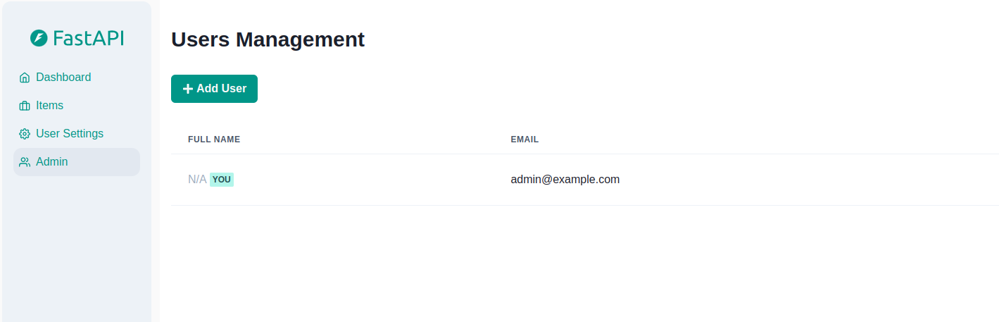

# Backend - Frontend FastAPI Template

This project is a customized version of [this](https://github.com/fastapi/full-stack-fastapi-template/) project, modified to work seamlessly with Microsoft Azure services. It includes a FastAPI backend and a frontend, which can be containerized and run as container instances or deployed in a multi-container app environment.

The backend is a JSON-based web API based on OpenAPI with automatic interactive documentation using Swagger UI (from the OpenAPI backend). The project depends on PostgreSQL.

To run the application, you should first create a Postgres database and obtain connection information to the database.

## Local Development

To test and run the application on a local machine, you can use a Postgres database managed by a PostgreSQL Docker image. Docker Compose will handle pulling and building the required Docker images.

### Steps to Run the Application Locally

1. **Build Docker Images:**
   Run the following command to build or pull the necessary images:
   ```bash
   docker compose build
   ```

2. **Start the Application:**
   Use this command to start all services:
   ```bash
   docker compose up
   ```

The Docker Compose files are configured so that each service is accessible on a unique port at `localhost`.

### Development URLs

Here are the URLs for local development:

- **Frontend:** [http://localhost:5173](http://localhost:5173)
- **Backend:** [http://localhost:8000](http://localhost:8000)
- **Interactive API Docs (Swagger UI):** [http://localhost:8000/docs](http://localhost:8000/docs)
- **MailCatcher:** [http://localhost:1080](http://localhost:1080)

## Docker Compose Files

Docker Compose uses two configuration files by default:

1. **`docker-compose.yml`**:
   - Contains the base configurations for deploying the backend and frontend in production environments, such as on a cloud platform or server.

2. **`docker-compose.override.yml`**:
   - Extends or overrides settings from `docker-compose.yml` for local development.
   - Configures a local Postgres container and port mapping for services.

## Environment Variables

Docker Compose reads configurations from the `.env` file. This file contains essential settings to be injected as environment variables into the containers, such as:

- Superuser credentials
- Database connection details

### Handling Sensitive Information

The `.env` file contains sensitive data, so handle it responsibly. It is recommended to avoid including sensitive information in the `.env` file and get information in a more secure way. For example, use environment variables set in your Azure Container Apps or Azure Web Apps.


## Deployment

This project can be deployed as containerized backend and frontend applications, using platforms such as Azure Container Instances or Docker Compose on a server.

For automated deployments, you can utilize CI/CD tools like Docker Hub, Azure Container Registry, and GitHub Actions.

### Database

Before starting, create a PostgreSQL database and gather the connection information.

For example, you can use a database server such as Azure Database for PostgreSQL - Flexible Server. The URL might look like `<your-postgres-database-name>.postgres.database.azure.com`.

Once you have the connection details, add them to the `.env` file or use environment variables in your container instance or web app service, as previously mentioned.

### Environment Variables

Set up the required environment variables in the `.env` file.

- **`ENVIRONMENT`**: Change the default value, `local` (for development), to `staging` or `production`.
- **`DOMAIN_ON_AZURE`**: Update the default, `localhost` (for development), to your domain name or the URL assigned in Azure (e.g., `<XXXXX>.<location>.azurewebsites.net`).
- **`VITE_API_LOCAL_URL`**: Change the default, `http://localhost:8000` (for development), to the backend IP or the URL assigned in Azure (e.g., `<XXXXX>.<location>.azurewebsites.net`).

### Generating Secret Keys

Some environment variables in the `.env` file have a default value of `changethis`. You need to replace these with actual secret keys. To generate a secure secret key, run:

```bash
python -c "import secrets; print(secrets.token_urlsafe(32))"
```

Copy the output and use it as a password or secret key.

--- 

Let me know if you'd like any further edits or additional information!


## Inteface

### Dashboard Login

[]

### Dashboard - Admin

[]

### Interactive API Documentation

[]


## License

The Full Stack FastAPI Template is licensed under the terms of the MIT license.
